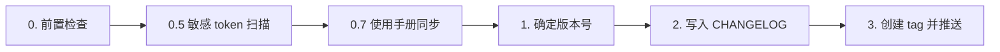

# Release Workflow

## Overview

发版流程：前置检查 → 确定新版本号 → 写入 CHANGELOG → 创建 tag 并推送。**只能在 main 分支执行**。

仓库只有**一套 tag**：平台与 CLI 共用同一条版本线，一个 `v*` tag 触发全部三个 workflow。

| Tag 前缀 | 用途 | CI 自动做的事 |
|----------|------|----------------|
| `v*`（如 `v0.7.1`）| 整个仓库发版（平台 + CLI） | ① 从 CHANGELOG 抽段落 → 创建 GitHub Release ② 构建并推送多架构 Docker 镜像到 GHCR ③ typecheck / test / 包内容校验 → 把 `a2wave` 包发到公共 npm（带 provenance，需 `NPM_TOKEN` 仓库 secret）|

因此 `package.json` 与 `apps/cli/package.json` 的 `version` **必须始终一致**，且都要与 tag 一致——两个 workflow 都会校验，不一致直接失败。

## When to Use

- 用户要求发版、打 tag、创建 release
- 需要更新 CHANGELOG 并推送新版本
- 关键词：发版、release、tag、changelog

## Core Workflow



### 步骤 0：前置检查（必须全部通过）

- **main 分支**：`git branch --show-current` 必须为 `main`。若非 main，中止并提示 `git checkout main` 后再执行。
- **与远程同步**：在 main 分支时，必须先执行 `git pull origin main`（或 `git pull`）。若 pull 产生冲突或失败，中止并提示用户解决后再发版。pull 成功后再进行后续检查。
- **测试通过**：`pnpm test:all` 必须零失败。失败则中止。
- **工作区干净**：`git status` 无未提交变更。若有其它未提交文件，提示用户先 commit 再发版。

### 步骤 0.5：敏感 token / 凭据扫描（HARD GATE，禁止跳过）

发版会把整份代码 tag 化并（主版本）触发 GitHub Release，一旦泄露的 secret 进入 tag，撤回成本极高。**打 tag 前必须对将要发布的全量代码做一次密钥扫描**：

```bash
# 全仓扫描（不只是本次 diff）——发版是整棵树的快照，必须全量
node scripts/gates/check-forbidden-tokens.mjs --all
```

- 该脚本覆盖 PEM 私钥、Anthropic key（`sk-ant-*`）、AWS、通用高熵 token 等规则，allowlist 在 `scripts/gates/forbidden-tokens-allowlist.json`。
- **exit 0** → 通过，继续。**exit 1** → 打印命中的「文件:行 规则」，**立即中止发版**：
  - 若是**真实泄露**：先清理（移除/改用 env/轮换该凭据），涉及历史提交的需 `git filter-repo` 或联系维护者，处理干净后重新走发版。
  - 若是**误报**（占位值 / 公钥 / fixture）：把精确 literal 或路径前缀加进 `forbidden-tokens-allowlist.json`，commit 后再继续。**禁止用 `--no-verify` 或跳过本步绕过。**
- 补充人工核查：`git diff <上一个tag>..HEAD -- '*.env' '*.env.*' '**/config/**'` 快速扫一眼配置类文件有无硬编码密钥；`.env`、`.kubeconfig`、私钥文件等**绝不允许**进入 tag。

### 步骤 0.7：使用手册（Wiki）同步

若本次发布区间（`<上一个tag>..HEAD`）包含**用户可感知**的功能/流程/触发方式变更，站内使用手册（`/wiki`）必须已同步，否则用户拿到新版本却查不到用法。

```bash
PREV=$(git tag -l 'v*' | sort -V | tail -1)
# 看区间内是否触及用户可见功能，且手册是否已一并更新
git log "$PREV"..HEAD --oneline | grep -iE 'feat|触发|页面|route|manual|wiki' || true
git diff --name-only "$PREV"..HEAD -- apps/web/src/content/manual/   # 手册是否有改动
```

- 判定「有用户可感知变更但手册无对应改动」时：**调用 `user-manual-sync` skill** 补齐 `apps/web/src/content/manual/zh/`（及 `en/`）后，作为独立 commit 落到 main，再继续发版。
- 手册确无需更新（纯内部/重构/CI/依赖）时，在发版 commit 或 release notes 中注明「手册无需更新」。
- 手册改动应在**打 tag 之前**合入 main，确保 tag 快照即含最新手册。

### 步骤 1：确定版本号

只有一种前缀 `v*`（平台与 CLI 共用一条版本线）：

- 用户指定：直接用（如 `v0.7.1`）
- Bump：`git tag -l 'v*'` 取最新，按 patch / minor / major 递增
- **两个 manifest 都要同步**：`package.json` 与 `apps/cli/package.json` 的 `version` 都改成 X.Y.Z，且与 tag 一致，否则 workflow 会拒绝发布

Semver 规则：
  - patch: 0.3.3 → 0.3.4
  - minor: 0.3.3 → 0.4.0
  - major: 0.3.3 → 1.0.0

### 步骤 2：写入 CHANGELOG

在 `CHANGELOG.md` 顶部插入新区块：

```markdown
## vX.Y.Z

- 变更摘要 1
- 变更摘要 2
```

变更摘要由用户提供，或从 `git log` 归纳（conventional commits）。

#### CHANGELOG 编写原则（务必遵守）

1. **用户视角，而非工程视角**：写「用户能感知到的功能与修复」——能做什么、修好了什么困扰，而不是内部实现。
   - ✅ 「群里 `/new` 一键重置会话开始新对话」
   - ❌ 「引入 Lifecycle Hook pipeline（onBeforeRun/onAfterRun…）」
   - 默认**剔除**这些纯内部条目：单测/e2e/测试基建、CI、依赖 dedupe/override、巡检报告、重构/改名/类型修复、lint、commit 规范——除非它直接改变用户可见行为或部署方式。
2. **覆盖完整区间，不要只写本次会话的几个提交**：版本号确定后先 `git rev-list --count <上一个tag>..HEAD` 看积压量；若有几十～上百个提交，必须 `git log <tag>..HEAD --merges`（看功能分支）+ `--no-merges | grep '^.* feat'`（看新特性）通盘归纳，按主题聚合，避免漏掉大功能。
3. **精简**：每条一句话讲清「价值」，一个版本通常 8～15 条主题级 bullet；不堆嵌套子项、不贴 commit hash、不抄提交标题。把同一功能的多个提交合并成一条。
4. **格式**：`## vX.Y.Z` + 中文 bullet，主题加粗（`**主题**：说明`），与历史段落保持一致。

> 速查归纳命令：
> ```bash
> PREV=$(git tag -l 'v*' | sort -V | tail -1)
> git rev-list --count "$PREV"..HEAD          # 积压量，判断该写多细
> git log "$PREV"..HEAD --merges --oneline    # 功能分支 = 主题来源
> git log "$PREV"..HEAD --no-merges --oneline | grep -iE ' feat'  # 新特性
> ```

> 若 tag 已推送且被服务器保护（`pre-receive hook declined`）无法移动：把完整 CHANGELOG 正常提交到 main，再用 `gh release edit <tag> --notes-file <file>` 直接更新 Release 展示。

### 步骤 3：创建 tag 并推送

```bash
# 先把两个 manifest 的 version 都改成 X.Y.Z
npm version X.Y.Z --no-git-tag-version
cd apps/cli && npm version X.Y.Z --no-git-tag-version && cd ../..

git add CHANGELOG.md package.json apps/cli/package.json && git commit -m "chore: release vX.Y.Z"
git tag vX.Y.Z
git push origin main && git push origin vX.Y.Z
```

也可以用 `bash apps/cli/scripts/tag-release.sh X.Y.Z` 打 tag，它会先校验两个 manifest 与 tag 一致、分支/工作区/远端同步状态。

推 tag 后 CI 自动跑三个 workflow：**Release**（建 GitHub Release）、**Docker**（推镜像）、**CLI Publish**（`.github/workflows/cli-publish.yml`：typecheck → test → build → 包内容校验 → 发到公共 npm）。

先 commit 再 tag，确保 tag 指向包含 changelog / version bump 的 commit。

### 步骤 4：等 CI Release job 完成

- 主版本：`gh release list` 看是否生成对应 `vX.Y.Z` 的 Release 条目
- CLI：`npm view a2wave versions --json` 查是否出现新版本

## Quick Reference

| 步骤 | 操作 |
|------|------|
| 0 | main 分支 + git pull + `pnpm test:all` 通过 + 工作区干净 |
| 0.5 | `node scripts/gates/check-forbidden-tokens.mjs --all` 零命中（敏感 token 扫描，HARD GATE） |
| 0.7 | 区间含用户可感知变更时，使用手册（`/wiki`）已同步（走 `user-manual-sync` skill） |
| 1 | 确定版本号（统一 `v*` 前缀）+ semver bump |
| 2 | CHANGELOG.md 顶部添加 `## vX.Y.Z` + bullet 列表 |
| 3 | 同步 `package.json` 与 `apps/cli/package.json` 版本 → commit → tag → push 分支 + push tag |
| 4 | 等 CI release job 完成，验证 GitHub Release / npm |

## Red Flags — STOP

- 在非 main 分支执行发版
- 在 main 分支发版前未执行 `git pull`
- **跳过敏感 token 扫描**（`check-forbidden-tokens.mjs --all`）就打 tag，或用 `--no-verify` 绕过命中
- 扫描命中却当误报草率放行（未确认是占位/公钥就加 allowlist）
- 区间内有**用户可感知**的功能变更，却没同步使用手册（`/wiki`）也没注明「无需更新」
- 先打 tag 再补 CHANGELOG
- 打 tag 但忘记 `git push origin <tag>`
- 只 push 分支不 push tag
- CHANGELOG 格式与现有不一致（须 `## vX.Y.Z` + 中文 bullet）
- CHANGELOG 写成工程视角（堆实现细节/测试/CI/依赖），或只写本次会话的几个提交、漏掉区间内的大功能（须按「CHANGELOG 编写原则」通盘归纳 `<tag>..HEAD`）
- 打 tag 但忘记同步 bump `package.json` 与 `apps/cli/package.json`（两个 workflow 都会因 tag 与 version 不一致而直接失败）

## Common Mistakes

| 错误 | 修正 |
|------|------|
| 在非 main 分支发版 | `git checkout main` 后再执行 |
| 发版前未 pull，导致 push 失败或落后于远程 | 先 `git pull origin main` 再执行后续步骤 |
| tag 指向未含 CHANGELOG 的 commit | 先 commit CHANGELOG 再 tag |
| 忘记 push tag | `git push origin <tag>` 与 push 分支一起执行 |
| 版本号格式错误 | 统一用 `vX.Y.Z` |
| tag 推上去但 npm 没新版本 | 仓库 secret `NPM_TOKEN` 未配置，去 GitHub → Settings → Secrets and variables → Actions 添加 |
